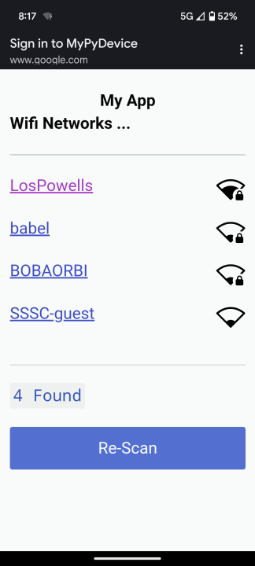
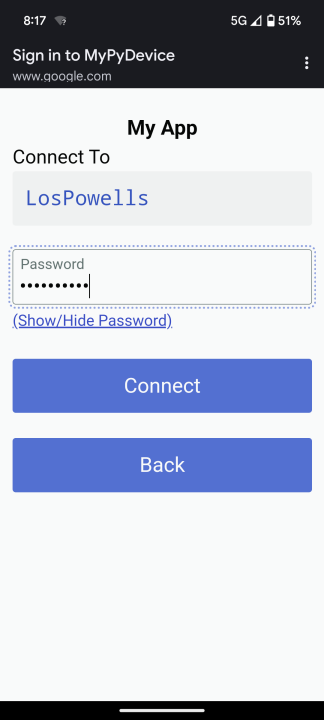

# Work In Progress
**This library is still under active development.**


# uPython Wifi Setup
A simple to install setup and use WiFi Setup Portal for micropython based ESP32 boards.


 

[All Screenshots](docs/SCREENSHOTS.md)


# Features
Inspired by https://github.com/george-hawkins/micropython-wifi-setup
- Reliable and Simple
- Low Memory Overhead
- ASYNC processing
- Very simple web-browser requirements.  Minimal Javascript.
- No separate web-app build step.  Just simple html template files. Not Fancy, Just Functional.
- Easy to integrate into your existing projects.
- Easy to build your project upon if desired.
- Easy to modify to make it your own.

# Tested On
- SEEED Xaio ESP32-S3
- SEEED Xaio ESP32-C3

# Dependencies
The following 2 libraries are required dependencies.  Recommended you drop these into your `/lib` directory on your device
- [utemplate](https://github.com/pfalcon/utemplate)
  - copy the directory `utemplate` in the repo to `/lib/utemplate` on your device
- [microdot](https://github.com/miguelgrinberg/microdot)
  - copy the directory `src/microdot` to `/lib/microdot` on your device
  - note, Not all microdot files are needed, you can skip the ones you don't want to use yourself. the only required files for this library are:
    - `__init__.py`
    - `microdot.py`
    - `utemplate.py`

# The Library Contents
Made up of 2 main parts. The .py source files, and the assets.
They are kept separate to simplify customizing this library.

## `uwifisetup` - The source
This is the library python files.  These files need to be in the `/lib` or the `/` root of your device.  Or, pre-frozen in the `modules` directory of a custom micropython firmware.

## `www` - The Assets
This is the assets directory.  Contains the `.html` template files, and a handfull of image and css assets.
These files by default are loaded from `/lib/uwifisetup/www` from your device. That is the default install location using the mip install method below.
If you wish to move these to a different install location on yoru deivce, you need only specify a different `templateFileRoot` parameter to `setup.setupWifi(...)`


# Install (EASIEST)
You'll need [mpremote](https://docs.micropython.org/en/latest/reference/packages.html#installing-packages-with-mpremote) installed on your system.
There are a number of ways to do the install, all platform dependant.
Linux/Mac
```sh
pip install mpremote
```

## MIP (.mpy)
Install `upython-wifi-setup` into `/lib/uwifisetup` on the device.
This installs the `.mpy` pre-compiled versions of this library, but still uses the `*.py` of the dependencies.  For now...
```sh
mpremote mip install "github:shaneapowell/upython-wifi-setup/package-deps.json"
mpremote mip install github:shaneapowell/upython-wifi-setup/package.json
```

## MIP (.py)
You can optionally install the non .mpy original source.
```sh
mpremote mip install "github:shaneapowell/upython-wifi-setup/package-deps.json"
mpremote mip install github:shaneapowell/upython-wifi-setup/package-raw.json
```

## Try It Out!
Copy the `example.py` file to your local system, and run it with `mpremote`. Follow the steps to connect to your wifi.
```sh
wget https://raw.githubusercontent.com/shaneapowell/upython-wifi-setup/main/examples/example.py
mpremote run example.py
```

- Re-Run the above example.py file again to then see it connect to your wifi.
- you can reset/clear the `creds.json` file to try it all again.
```sh
mpremote rm /creds.json
```

# Install (Easy)
- Clone this repo
  ```sh
  git clone https://github.com/shaneapowell/upython-wifi-setup.git
  git submodule init
  git submodule update
  ```
- install [pipenv](https://pypi.org/project/pipenv/).
  ```sh
  pip3 install pipenv
  ```
- Plug in your micropython esp32 device usb to your computer.  The `Pipfile` has `/dev/ttyACM0` hard-coded as your upy device.
- Sync the pipenv venv packages. This is only needed once, or with any new updates to the `Pipfile`.
  ```sh
  pipenv sync
  ```
- Install the [microdot](https://github.com/miguelgrinberg/microdot) and [utemplate](https://github.com/pfalcon/utemplate/) package dependencies into `/lib` on the device
  ```sh
  pipenv run deploy_deps
  ```
- Optional build the pre-compiled parts. Optional because the `dist` folder should already have the most recent-pre-compiled.
  Note: YOu'll see some like `ModulenotFoundError: No Module named `_uwifisetup/complete_html`. You can safely ignore those.
  ```sh
  pipenv run build
  ```
- Deploy the code and assets into the `/lib` directory.
  ```sh
  pipenv run deploy /dev/ttyACM0
  ```

- Try it Out. Run the example
  ```
  pipenv run example
  ```
- Connect your phone to the wifi access point named `MyPyDevice`
- After the setup is complete, the device should reset itself.
- Re-Run the above example, and the command should finish with a message
  ```
  Connected to wifi Success
  ```
- Re-Run the example now, to see the wifi connect using your new creds
  ```sh
  pipenv run example
  ```
- Re-Set your creds to try all over again
  ```sh
  pipenv run example_reset
  ```

# Install (Manual)
Because you're the type of person who needs to do things manually.  You can inspect the `Pipfile` for commands to reference.
- Manually Install the `microdot` and `utemplate` dependencies.
- Manually copy over the `dist/uwifisetup` (pre-compiled) or `src/uwifisetup` (source) files to `/lib/uwifisetup`.
- Manually copy over the `dist/www` (pre-compiled) or `src/www` (source) files to `/lib/uwifisetup/www`
- if you copied the pre-compiled `dist/www` files, you'll also need to copy over the `src/www/_uwifisetup/assets` files into `/lib/uwifisetup/www/_uwifisetup/assets`


# Pre-Build for Maximum Performance
TBD

# Freeze into a custom firmware
TBD

# Credentials
The access point name, and wifi password are stored in a plain text json file `creds.json` in the root of the data parition.

# Reference
Functions and Use Reference

## `uwifisetup.setup.py`
- setupWifi()
- shutdown()

## `uwifisetup.wifi.py`
- hasCredentials()
- factoryReset()
- saveCredentials()
- loadCredentials()
- connectWifi()
-

# How to incorporate what this library provides into your project
- include udot web server
- included cutestrap css
- included custom css and js

# Development
- Clone repo
  ```sh
  git clone https://github.com/shaneapowell/upython-wifi-setup.git
  git submodule update
  ```
- Modify `setup.py`. Near the top, Comment out the `DEFAULT_TEMPLATE_LOADER_CLASS=utemplate.compiled.Loader`. Uncomment the `#DEFAULT_TEMPLATE_LOADER_CLASS=utemplate.recompile.Loader` line.
- Deploy dependencies as normal
  ```sh
  pipenv run deploy_dependencies
  ```
- Deploy raw source files
  ```sh
  pipenv run deploy_raw /dev/ttyACM0
  ```
- Try it out
  ```sh
  pipenv run example
  pipenv run example_reset
  ```

# CI
- pipenv sync
- pipenv run linter
- pipenv run typechecker


# Reference
- https://www.cutestrap.com/