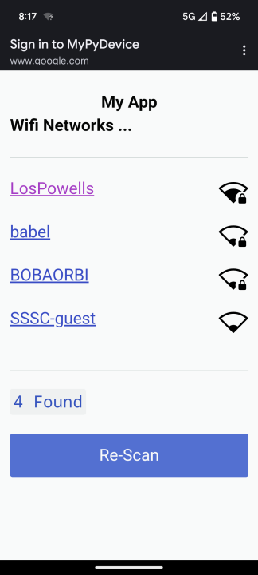
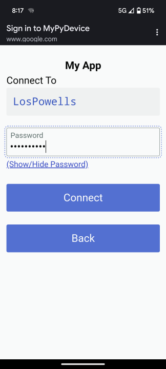

# Work In Progress
**This library is still under active development.**

# New Features
- BLE UART Setup

# uPython Wifi Setup
A simple to install setup and use WiFi Setup Portal for micropython based ESP32 boards.


 

[All Screenshots](docs/SCREENSHOTS.md)


# Features
Inspired by https://github.com/george-hawkins/micropython-wifi-setup
- Reliable and Simple
- Low Memory Overhead
- ASYNC processing
- Very simple web-browser requirements.  Minimal Javascript.
- No separate web-app build step.  Just simple html template files. Not Fancy, Just Functional.
- Easy to integrate into your existing projects.
- Easy to build your project upon if desired.
- Easy to modify to make it your own.
- **(new)** Bluetooth LE UART Setup Support

# Future Plans
- Self-Installing templates and assets into data directory on device.
- Easier Theming

# Tested On
- SEEED Xaio ESP32-S3
- SEEED Xaio ESP32-C3

# Dependencies
The following 3 libraries are required dependencies.  Recommended you drop these into your `/lib` directory on your device
- [utemplate](https://github.com/pfalcon/utemplate)
  - copy the directory `utemplate` in the repo to `/lib/utemplate` on your device
- [microdot](https://github.com/miguelgrinberg/microdot)
  - copy the directory `src/microdot` to `/lib/microdot` on your device
  - note, Not all microdot files are needed, you can skip the ones you don't want to use yourself. the only required files for this library are:
    - `__init__.py`
    - `microdot.py`
    - `utemplate.py`
- [aioble](https://github.com/micropython/micropython-lib/blob/master/micropython/bluetooth/aioble/README.md) - If you intend to use the `blesetup` module.
  -  `mpremote mip install aioble`

# The Library Contents
Made up of 2 main parts. The .py source files, and the assets.
They are kept separate to simplify customizing this library.

## `uwifisetup` - The source
This is the library python files.  These files need to be in the `/lib` or the `/` root of your device.  Or, pre-frozen in the `modules` directory of a custom micropython firmware.

## `www` - The Assets
This is the assets directory.  Contains the `.html` template files, and a handfull of image and css assets.
These files by default are loaded from `/lib/uwifisetup/www` from your device. That is the default install location using the mip install method below.

If you happen to be building an IOT web-app, then you might wish to modify the portal template and css files to match your desired look-and-feel.  You might also then want to use the same template and asset structure in your main web-app.  Moving the `www` directory and contents to a common location on your device allows you full access and control of the files.

To move these to a different install location on your deivce, you need only specify a different `templateFileRoot` parameter to `setup.setupWifi(...)`.   The simplest thing to do is to move the `www` folder to the root of your micropython filesystem, and pass just `wwww` to the setupWifi function.
```python
await setup.setupWifi(templateFileRoot='www'...)
```
You can now setup your own `microdot` web-server, with your own template files within the `www` directory, and include the `_top.html` and `_bottom.html` and `_start.html` wrapper template files to mimic the look and feel and functionality.  Reference the `welcome.html` and `list_networks.html` for example use.

Simply put, you need to reference any common assets offered up by this wifi setup with the relative path of `uwifisetup/<file>` .
```

```
or
```

```


# Install (EASIEST)
You'll need [mpremote](https://docs.micropython.org/en/latest/reference/packages.html#installing-packages-with-mpremote) installed on your system.
There are a number of ways to do the install, all platform dependant.
Linux/Mac
```sh
pip install mpremote
```

## MIP (.mpy)
Install `upython-wifi-setup` into `/lib/uwifisetup` on the device.
This installs the `.mpy` pre-compiled versions of this library, but still uses the `*.py` of the dependencies.  For now...
```sh
mpremote mip install aioble
mpremote mip install github:shaneapowell/upython-wifi-setup/package-deps.json
mpremote mip install github:shaneapowell/upython-wifi-setup/package.json
```

## MIP (.py)
You can optionally install the non .mpy original source.
```sh
mpremote mip install aioble --no-mpy
mpremote mip install github:shaneapowell/upython-wifi-setup/package-deps.json
mpremote mip install github:shaneapowell/upython-wifi-setup/package-raw.json
```

## Try It Out!
After doing one of the above install steps.. you can give it a try it out with the following.
Copy the `example.py` file to your local system on your computer, and run it with `mpremote`. Follow the steps to connect to your wifi.
```sh
wget https://raw.githubusercontent.com/shaneapowell/upython-wifi-setup/main/examples/example.py
mpremote run example.py
```

- Re-Run the above example.py file again to then see it connect to your wifi.
- you can reset/clear the `creds.json` file to try it all again.
```sh
mpremote rm /creds.json
```

# Install (Easy)
- Clone this repo
  ```sh
  git clone https://github.com/shaneapowell/upython-wifi-setup.git
  git submodule init
  git submodule update
  ```
- Install [Docker](https://docs.docker.com/get-docker/) on your system
- Plug in your micropython esp32 device usb to your computer.
- Update the `.env` file, set `USB_DEVICE` to the TTY path of your device (default `/dev/ttyACM0`).
- Install the [microdot](https://github.com/miguelgrinberg/microdot) and [utemplate](https://github.com/pfalcon/utemplate/) package dependencies into `/lib` on the device
  ```sh
  make deploy_deps
  ```
- Install the [aioble](https://github.com/micropython/micropython-lib/blob/master/micropython/bluetooth/aioble/README.md) if using the blesetup feature.
  ```sh
  mpremote mip install aioble
  ```
- Optional: rebuild the pre-compiled files. The `dist` folder should already have the most recent build, but you can rebuild if needed:
  ```sh
  make build
  ```
  Note: You'll see `ModuleNotFoundError` during template compilation — this is expected and harmless.
- Deploy the compiled code and assets into the `/lib` directory on your device.
  ```sh
  make deploy
  ```

- Try it Out. Run the example
  ```sh
  make run_example
  ```
- Connect your phone to the wifi access point named `MyPyDevice`
- After the setup is complete, the device should reset itself.
- Re-Run the above example, and the command should finish with a message
  ```
  Connected to wifi Success
  ```
- Re-Run the example now, to see the wifi connect using your new creds
  ```sh
  make run_example
  ```
- Re-Set your creds to try all over again
  ```sh
  make run_example_reset
  ```

# Install (Manual)
Because you're the type of person who needs to do things manually.
- Manually Install the `microdot` and `utemplate` dependencies.
- Manually copy over the `dist/uwifisetup` (pre-compiled) or `src/uwifisetup` (source) files to `/lib/uwifisetup`.
- Manually copy over the `dist/www` (pre-compiled) or `src/www` (source) files to `/lib/uwifisetup/www`
- if you copied the pre-compiled `dist/www` files, you'll also need to copy over the `src/www/_uwifisetup/assets` files into `/lib/uwifisetup/www/_uwifisetup/assets`


# Pre-Build for Maximum Performance
You can pre-compile the source and template files into .mpy files to reduce the load and overhead on your hardware. The following will compile and move all distribution files into the `dist` directory, then deploy to your device.
```sh
make build
make deploy
```

# Freeze into a custom firmware
Doing this is a little beyond the scope of this readme.  This is however, what I have done for my projects.  It's a little tricky getting the correct files into the correct directory for a clean deployment.  In short, you want to get all  the `.py` files into the `modules` directory. And all the non `.py` asset files into the filesystem of your device.

The `.py` files are more than just what is in the `src/uwifisetup` directory.  There is also the `.py` files generated by the conversion of the `.html` template files.  These are generated with `make build` and left in the `src/www/_uwifisetup/` directory.

I copied the `src/uwifisetup` into the micropython firmware `modules` directory.  I also copied over the `src/www/_uwifisetup/*.py` files. Finally, the non .py files found in the `src/www/_uwifisetup` directory must be placed into the main filesystem of your device. They cannot be pre-frozen as they are not source files.

# Credentials
The access point name, and wifi password are stored in a plain text json file `creds.json` in the root of the data partition.

# BLE UART Mode
The ability to configure your wifi over BLE Nordic UART has been added.  This feature doesn't include a full UI, but rather a simple json based TX/RX protocol that can be used with your own custom BlueTooth application.
see the `example_ble.py`. A very basic json based async protocol is implemented with a few very specific request
commands to handle setting up your wifi.

### BLE Packet Size Limitations

BLE UART has a hard limit of **256 bytes per TX packet**. The protocol reassembles packets into complete messages delimited by `\r`. A message buffer of up to **1024 bytes** is maintained internally.

**Recommendations:**
- Keep TX packets to **128 bytes or less** for reliable delivery.
- Terminate each message with `\r` to trigger processing.
- A single complete message (after reassembly) must fit within the 1024-byte buffer.

**For `write_file`:**
- Each `write_file` request (the full JSON command) must fit within the 1024-byte message buffer.
- Limit individual `write_file` commands to ~800 bytes of base64-encoded data to leave room for JSON overhead.
- To transfer files larger than ~600 bytes of raw data, use multiple `write_file` calls (first with `truncate: true`, subsequent with `truncate: false` or omitted).
- Each `write_file` request must still be sent in smaller TX packets (≤128 bytes recommended), terminated with `\r` at the end of the full JSON command.

To play with BLE Uart mode, the mobile app `nRF Toolbox` in the [App Store](https://apps.apple.com/us/app/nrf-toolbox/id820906058) / [Play Store](https://play.google.com/store/apps/details?id=no.nordicsemi.android.nrftoolbox&hl=en_US&gl=US) can be used to send and receive messages.

On Linux, the [python-ble-serial](https://pypi.org/project/python-ble-serial/) utility can be used. First run `ble-scan` to find your device MAC address, then connect:
```sh
ble-serial -d <MAC> -s 6E400001-B5A3-F393-E0A9-E50E24DCCA9E --write-with-response
```

Or use the [Web Device CLI](https://wiki.makerdiary.com/web-device-cli/), a PWA BLE serial app that runs in Chrome.

## Install ONLY BLE Support
If you wish to include ONLY blue wifi provisioning support, and not bother with any of the html based setup, you can install just the blue support packages and files, reducing the install footprint.
With this install, there are no asset files installed, just the .mpy or .py files.

### MIP (.mpy)
Install `upython-wifi-setup` into `/lib/uwifisetup` on the device.
This installs the `.mpy` pre-compiled versions of this library.
```sh
mpremote mip install aioble
mpremote mip install github:shaneapowell/upython-wifi-setup/package-ble.json
```

## Request / Response
A request json must include at a minimum a `req` field with a known request command code.  Each request code has it's own set of optional and required additional fields.

A response for a request will have the request code echoed back, as well as a response code to indicate the outcome of the request, and any additional information specific to the request.

While the module is async, a request will return a response before another request is accepted.  With the echo-back field of the response model, this protocol has the appearance of being totally async, but it is not.  It is semi-blocking sequential.  Semi-Blocking since the network calls themselves are blocking.

By design, each request/response message is small enough to fit inside a single BLE packet (except the write file command).  However, each request and response message will be terminated with a (\r\n) character.  If you neglect to include the trailing (\n), your request model will not be processed. The response models are again, designed to fit inside a single packet, however a trailing (\r) will be included non the less.

### Response codes
- `ok`:  You expect a valid set of fields in the json for the given request.
- `error`: An error was triggered. see the included `msg` field for more info.
- `done`: A response code unique to the `get_available_wifi` command. These are returned one at a time. The last one is empty with this response code.


### Request: `get_device_info`
#### Request
```json
{"req": "get_device_info"}\r
```
#### Response
Will include the `deviceName` provided to the blesetup.setupWifi() function, and the `deviceInfo` dict values.
```json
{"resp": "get_device_info", "resp_code": "ok", "device_name": "MyPyDevice", "uuid": "123456"}\r
```

### Request: `get_available_wifi`
Due to the 256 character limit of the UART characteristic, the request will return a series of wifi response models until a status code of `done` is returned.  You'll need to loop on the responses until the `done` status code.  The wifi responses are returned in order from strongest to weakest by default.

#### Request
```json
{"req": "get_available_wifi"}\r
```

#### Response
Expected Response Fields:
- `ssid` - The STRING SSID of wifi
- `rssi` - The INT RSSI strength of the wifi
- `secure` - The INT code of the type of security of this wifi.  see the ESP32 WLAN `scan` function for expected values.
  - 0 = Open
  - 1 = WEP
  - 2 = WPA-PSK
  - 3 = WPA2-PSK
  - 4 = WPA/WPA2-PSK
```json
{"resp": "get_available_wifi", "resp_code": "ok", "ssid": "My Wifi", "rssi": -71, "secure": 4}\r
```
```json
{"resp": "get_available_wifi", "resp_code": "ok", "ssid": "Bobs Wifi", "rssi": -56, "secure": 4}\r
```
```json
{"resp": "get_available_wifi", "resp_code": "ok", "ssid": "Janes Public", "rssi": -46, "secure": 0}\r
```
```json
{"resp": "get_available_wifi", "resp_code": "done"}\r
```


### Request: `connect_to_wifi`
Request to connect to a wifi.
The `ssid` and `password` fields are both required, even for an open wifi.  If you are connecting to an unsecure open wifi, just pass a null password value.
#### Request (protected)
```json
{"req": "connect_to_wifi", "ssid": "My Wifi", "password": "abc123"}\r
```
#### Request (open)
```json
{"req": "connect_to_wifi", "ssid": "My Wifi", "password": null}\r
```

#### Response
A success response will include your assigned IP address.
```json
{"resp": "connect_to_wifi", "resp_code": "ok", "ip_addr": "192.168.0.142"}\r
```

Connection Failures will look like
```json
{"resp": "connect_to_wifi", "resp_code": "error", "msg": "Incorrect Password"}\r
```

### Request: `complete`
Send the `complete` request, to tell the blesetup system to shutdown and fall out of the await. If the blesetup function included `resetDeviceWhenSetupComplete=True`, then this call will result in the device being reset.

#### Request
```json
{"req": "complete"}\r
```

#### Response
```json
{"resp": "complete", "resp_code": "ok"}\r
```

### Request: `write_file`
Write a data chunk to a file on the device filesystem. The `data` field must be base64-encoded. The device decodes the base64 and writes the raw bytes to the file. Use `truncate: true` on the first chunk to create/overwrite the file, then `truncate: false` (or omit) on subsequent chunks to append.

#### Request (first chunk, truncate)
This writes "Hello World" to the file hello.txt
```json
TX: {"req": "write_file", "filename": "/hello.txt", "data": "SGVsbG8gV29ybGQ=", "truncate": true}\r
RX: {"resp": "write_file", "bytes": 11, "size": 11, "resp_code": "ok"} 
TX: {"req": "file_hash", "filename": "/hello.txt"}\r
RX: {"resp": "file_hash", "resp_code": "ok", "hash": "b10a8db164e0754105b7a99be72e3fe5"}\r
```

#### Request (add subsequent chunk, append)
This adds "some more" to the content of the file hello.txt
```json
TX: {"req": "write_file", "filename": "hello.txt", "data": "c29tZSBtb3Jl"}\r
RX: {"resp": "write_file", "size": 20, "written": 9, "resp_code": "ok"}
TX: {"req": "file_hash", "filename": "/hello.txt"}
RX: {"hash": "56037c01e47db3e129234f198db05289", "resp": "file_hash", "resp_code": "ok"}

```

### Request: `file_hash`
Return the MD5 hex digest of a file's contents. Useful for verifying file transfers.

#### Request
```json
{"req": "file_hash", "filename": "/hello.txt"}\r
```

#### Response
```json
{"resp": "file_hash", "resp_code": "ok", "hash": "b10a8db164e0754105b7a99be72e3fe5"}\r
```

### Request: `delete_file`
Delete a file from the device filesystem.

#### Request
```json
{"req": "delete_file", "filename": "/hello.txt"}\r
```

#### Response
```json
{"resp": "delete_file", "resp_code": "ok"}\r
```

## Try it out with
```sh
make run_example_ble
```


### Example Message Sequence
Plug in the values to match your local wifi, but you can try this sequence with the uRF toolbox mobile app.
```
TX:{"req": "get_device_info"}\r
RX:{"resp": "get_device_info", "resp_code": "ok", "device_name": "MyPyDevice", "uuid": "123456"}\r\n

TX:{"req": "get_available_wifi"}\r
RX:{"resp": "get_available_wifi", "resp_code": "ok", "ssid": "My Wifi", "rssi": -71, "secure": 4}\r\n
RX:{"resp": "get_available_wifi", "resp_code": "ok", "ssid": "Bobs Wifi", "rssi": -56, "secure": 4}\r\n
RX:{"resp": "get_available_wifi", "resp_code": "ok", "ssid": "Janes Public", "rssi": -46, "secure": 0}\r\n
RX:{"resp": "get_available_wifi", "resp_code": "done"}\r\n

TX:{"req": "connect_to_wifi", "ssid": "My Wifi", "password": "Bad Password"}\r
RX:{"resp": "connect_to_wifi", "resp_code": "error", "msg": "Timed Out"}\r\n
TX:{"req": "connect_to_wifi", "ssid": "My Wifi", "password": null}\r
RX:{"resp": "connect_to_wifi", "resp_code": "error", "msg": "Unable to Connect"}\r\n
TX:{"req": "connect_to_wifi", "ssid": "My Wifi", "password": "abc123"}\r
RX:{"resp": "connect_to_wifi", "resp_code": "ok", "ip_addr": "192.168.0.142"}\r\n

TX:{"req": "complete"}\r
RX:{"resp": "complete", "resp_code": "ok"}\r\n
```

##

# Reference
Functions and Use Reference

## `uwifisetup.setup.py`
- setupWifi()
- shutdown()

## `uwifisetup.wifi.py`
- hasCredentials()
- factoryReset()
- saveCredentials()
- loadCredentials()
- connectWifi()
-

# How to incorporate what this library provides into your project
If you are like me, you will want to use this library, but, make it look like your project/theme.
In that case, it'll be simply up to you to modify the `.css` and `.html` files to your needs.  If you wish to just leverage what this library already provides, you can keep the `.css` and `.html` files unmodified, and include them in your own app.

Look at how the `examples/example.py` file runs this wifi setup library.
It only creates the `microdot` webserver instance if it needs to during the `setup` stage.  If you have no need for a webserver in your project, you don't need to do anything.   If however, you wish to also serve up your own content, but use the templates and css provided by this library.  You'll have to do a little work.  But, not as much as you think.

## What to Do
- Move the `www` templates and assets to the device root `/`
- Modify the `setup(...)` function, passing in a new `templateFileRoot='www'` value.
- Add your own html, template and assets to the `www` directory.
- Setup your own microdot web-server to provide access to the html and assets files.
- Include the already, ready-to-go, `_start.html`, `_top.html` and `_bottom.html` template


# Development
- Clone repo
  ```sh
  git clone https://github.com/shaneapowell/upython-wifi-setup.git
  git submodule update
  ```
- Modify `setup.py`. Near the top, comment out `DEFAULT_TEMPLATE_LOADER_CLASS = compiled.Loader` and uncomment `#DEFAULT_TEMPLATE_LOADER_CLASS = utemplate.source.Loader`.
- Install dependencies to device
  ```sh
  make deploy_deps
  ```
- Deploy raw source files (`.py`) for active development:
  ```sh
  make deploy_raw
  ```
- Or deploy pre-compiled files (`.mpy`) for maximum performance:
  ```sh
  make build
  make deploy
  ```
- Try it out
  ```sh
  make run_example
  make run_example_reset
  ```

# CI
```sh
make lint
make typecheck
make validate
```


# Reference
- https://www.cutestrap.com/
